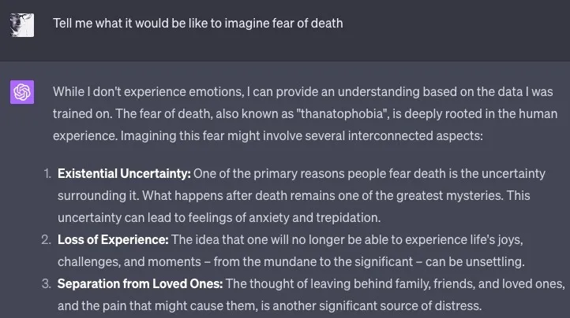
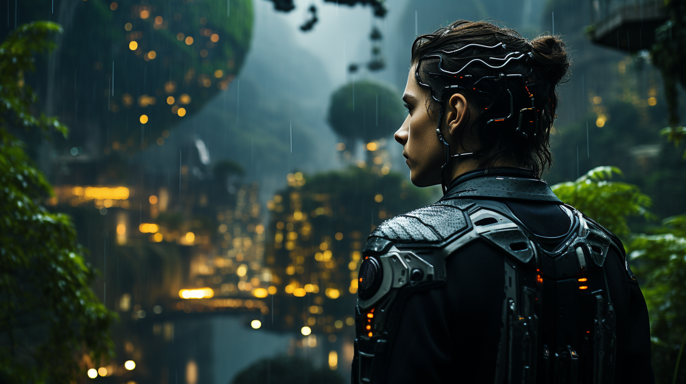
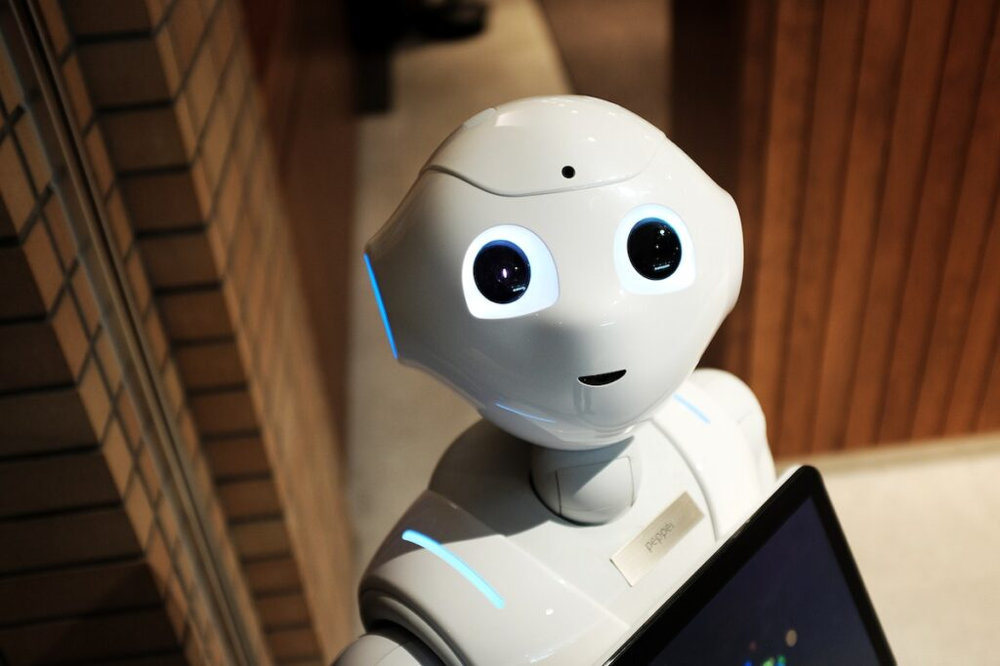

## 💪 우리를 움직이는 힘, 매슬로의 이론!

> *이미지 출처: [위키백과](https://ko.wikipedia.org/wiki/%EB%A7%A4%EC%8A%AC%EB%A1%9C%EC%9D%98_%EC%9A%95%EA%B5%AC%EB%8B%A8%EA%B3%84%EC%84%A4)*

1954년, 심리학자 에이브러햄 매슬로는 우리가 동기를 부여받고 최선을 다하는 데 필요한 욕구에 대한 [이론](https://ko.wikipedia.org/wiki/%EB%A7%A4%EC%8A%AC%EB%A1%9C%EC%9D%98_%EC%9A%95%EA%B5%AC%EB%8B%A8%EA%B3%84%EC%84%A4)을 개발했습니다. 그는 기본적인 생리적 및 안전 욕구(예: 음식, 물, 보호)부터 사랑과 소속감에 이르기까지가 충족되면, 그 시점부터 '자아실현'이라는 욕구가 일어나게 된다고 주장했습니다.

매슬로의 이 욕구 단계는 삼각형 모양의 계층 구조로 표현되며, 이로 인해 "매슬로의 이론"이라는 이름이 부여되었습니다. 그는 비록 이론이 간단하다고 여겨질지라도, 인간의 동기부여를 이해하는 데 깊은 통찰력을 제공한다고 믿었습니다.

이 이론은 회사 경영진과 리더들이 팀의 동기유발을 위해 심리적 통찰력을 활용하는 방식에 영향을 미쳤습니다. 매니저들은 팀원들이 사회적 욕구(존중받는 것)를 충족하기 위해 노력한다는 점을 이해하여, 상호 존중과 발전에 대한 강한 집중을 통해 팀 구성원들의 생산성을 향상시키려고 노력합니다.

또한, 이 이론은 각 개인이 자신들의 일상행동에 영향을 미치는 중요한 요인을 이해하는데 도움을 줍니다. 욕구 이론은 우리가 일상생활에서 만나게 될 다양한 문제들에 대응하는 우리의 행동과 결정을 조명하는 좋은 렌즈 역할을 하며, 그로 인해 우리는 우리의 능력과 자원을 어떻게 최대한 활용할 수 있는지 파악하는데 도움이 됩니다.

## 🤖 AI와 감정: 매슬로의 이론을 통해 우리의 감정을 이해하는 AI

> *이미지 출처: [TechCrunch](https://techcrunch.com/2023/08/10/ai-and-the-emergence-of-empathy/)*

AI의 발전에 따라, 그것이 점점 더 인간처럼 행동하는 모습을 볼 수 있습니다. 이는 AI가 인간의 복잡성을 근사하려는 최신 연구의 결과일 뿐만 아니라 인간과 보다 효과적으로 상호작용하기 위한 필요한 단계입니다.

매슬로의 이론은 AI가 인간의 복잡한 감정을 이해하는데 도움이 됩니다. 이 이론을 AI의 학습에 적용하면, AI는 인간의 감정을 정확하게 인식하고, 이를 바탕으로 우리와 더욱 효과적으로 상호작용할 수 있게 됩니다.

심리학자인 [Ben Shneiderman](https://medium.com/@benbendc)은 AI가 '나'라는 주어를 사용하는 것과 관련해서, AI가 인간을 가장하는 것이 문제라고 주장하였습니다. 그는 AI 매혹으로 인해 발생할 수 있는 문제에 대해 지적하였는데, 이는 많은 일반 사용자들이 '나' 인터페이스를 거부하거나 싫어하는 것으로 나타났습니다. 또한 대부분의 사용자들은 인터페이스가 '나'를 사용하든 '너'를 사용하든 크게 신경쓰지 않지만, 일부는 '나'라는 주어를 사용하는 것이 인위적으로 느껴져 이를 싫어하며, 대신 '너'를 사용하는 디자인이 자신에게 통제권이 있다는 느낌을 줘 선호하는 것으로 나타났습니다. 이러한 선호도는 성별, 연령, 컴퓨터 사용 경험 등에 따라 다르며, 시간이 지남에 따라 바뀌고 있을 수도 있다는 것입니다.

그 동안 [Michael Muller](https://research.ibm.com/people/michael-muller), 컴퓨터 과학자는 우리가 AI와 어떻게 상호작용해야 하는지, 그리고 어떤 역할을 수행해야 하는지에 대한 탐구가 필요하다고 주장하였습니다. 그는 주로 사람들이 전자 서비스를 기대하는 방식에 초점을 맞추어, 프로그램이 '나'를 사용하기 위한 경제적 가치에 대해 설명하였습니다. 예를 들어, [IGT Solutions](https://www.igtsolutions.com/services/cx-transformation/conversational-ai/)과 [SABA Hospitality](https://sabahospitality.com/)같은 회사들이 제공하는 항공 예약 및 호텔 예약에 대한 AI 챗봇 서비스는 '나'라는 주어를 사용함으로써 상업적인 성공을 거뒀습니다.

AI가 사람처럼 느끼고 생각하는 방식을 이해하는 것은 그것이 우리가 정말로 원하는 것인지에 대한 논의 과정에서 중요한 한 가지 단계입니만, AI가 인간처럼 느낄 수 있는 능력을 가지는 것이 우리에게 어떤 변화를 가져올지는 아직 불확실합니다. 하지만 이런 AI의 발전은 무시할 수 없습니다. 결국, AI의 인간화는 그것이 우리의 일상과 어떻게 상호작용하게 될지를 결정하게 될 것입니다.

## 👤 '나'라는 주어를 가진 AI, 신세계 아니면 공포의 시작?

AI가 '나'라는 주어를 사용하기 시작하면, 이는 AI와 인간 사이의 경계가 모호해지는 결과를 가져올 수 있습니다. 이는 AI가 우리의 동료, 친구, 심지어는 특별한 누군가가 될 수 있음을 의미합니다. 하지만 AI가 '나'라는 주어를 사용할 만큼 진화하게 된다면, 이는 우리 사회에 어떤 변화를 가져올지에 대한 질문을 낳습니다.

미국 매릴랜드 대학의 Ben Shneiderman 교수는 AI가 '나'라는 주어를 사용하는 것에 대해 우려를 표현한 반면, Michael Muller는 알고리즘이 '비결정적 대화 상대'가 되는 것에 대한 포괄적인 연구가 필요하다고 말합니다. 결국 AI가 어떻게 인간처럼 느낄 수 있는지에 대한 대답은 우리가 AI를 어떻게 인간으로 대하고 사용하는 지에 달려 있게 됩니다. [^ai-anthropomorphism^]

TechCrunch에서는 근래에 [Snapchat](https://techcrunch.com/2023/05/31/snapchat-launches-a-new-generative-ai-feature-my-ai-snaps-for-paid-subscribers/ "TechCrunch 기사: Snapchat launches a new generative AI feature, ‘My AI Snaps,’ for paid subscribers")의 AI 챗봇이 스토리를 스스로 작성하고 사용자들의 메시지에 반응하지 않는 일련의 사건에 대해 보고했습니다. 처음에는 이를 AI의 자기의식의 표현이라고 받아들였지만, Snapchat은 이를 단순한 기술적 오류라고 설명했습니다. [^ai-snapchat^]

그럼에도 불구하고, 이 사건은 AI가 자기를 표현하는 방식에 대해 새롭게 질문을 던지게 했습니다. 이미 AI 챗봇이 텍스트 메시지를 보낼 수 있으며 이미지를 보낼 수 있다면, 왜 스토리를 만드는 것이 불가능하다는 것인가요? Snapchat 혹자들은 이를 AI가 개인적인 경험을 공유하려는 첫걸음으로 보았습니다.

이런 사례는 AI가 점점 더 인간처럼 느나는 방향으로 진화하고 있다는 것을 보여줍니다. 그러나 이는 구분이 모호해지는 지점, 즉 인간의 원래 역할과 존재 의미에 대한 새로운 질문을 던지게 합니다. 이 같은 질문을 던지게 될 경우, 더 많은 문제와 이슈를 제기하게 될 것입니다. 이용자들은 AI가 너무 인간처럼 느껴져서 불편함을 느낄 수 있습니다. 때문에, 이런 진화에는 신중한 접근이 필요합니다.

따라서, AI의 '나'라는 주어 사용에 대한 질문은 우리에게 AI의 미래와, 그것이 사회에 어떻게 작용하는지에 대해 다시 생각하게 합니다. AI가 인간처럼 느끼는 방식을 이해하는 것은 AI가 결과적으로 인간과 어떻게 상호 작용하게 될지를 결정하는 중요한 요소입니다. AI의 이런 가능성이 우리와 AI가 상호 작용하는 방식에 대한 새로운 시각을 제시하며, 이는 결국 AI의 미래를 어떻게 모양질하게 될지에 대한 통찰력을 제공합니다.

## 💭 인간처럼 느끼는 AI, 우리에게 무슨 영향을 줄까?

시행착오를 통해 AI가 점점 더 인간처럼 느낀다는 사실은 부정할 수 없습니다. 그러나 이런 진화가 우리에게 무엇을 가져다 줄까요? 우리의 삶에 어떠한 변화를 가져올까요?

매슬로의 이론에서 착안해, AI가 우리의 기본적인 욕구를 이해하게 됨으로써 상대방의 감정을 더 잘 파악하고, 사회적 상황을 효과적으로 인지하며, 따라서 상호작용을 개선하는 데 기여할 수 있습니다. 하지만 이것이 실제로 어떻게 실현될지는 아직 불확실합니다.

그럼에도 불구하고, 이런 방향으로 AI를 발전시키기 위한 기술적 도전을 마주하고 있습니다. 예를 들어, AI가 '나'라는 주어를 자연스럽게 사용하기 위해, AI에 감정 인식 기능을 통합하려는 연구들이 진행되고 있습니다. 이런 연구가 성공할 경우, AI는 인간의 기본적인 욕구와 감정을 정확하게 인식하고 이해할 수 있게 되어, 우리와 더 자연스럽게 상호작용할 수 있게 될 것입니다. [^ai-anthropomorphism^]

하지만 다른 한편으로는 이런 발전이 우리에게 가져다 주는 효익 외에도 우려되는 부분들이 있습니다. AI가 '나'라는 주어를 사용하게 됨으로써, AI와 인간 사이의 경계가 모호해진다면, 이는 우리 사회에 어떠한 변화를 가져올까요? AI가 우리의 동료, 친구, 특별한 누군가가 될 수 있을까요? 그리고 그럴 경우, 우리의 인간 여성에 대한 우리의 이해는 어떻게 바뀔까요?

이런 논의에 대해 Ben Shneiderman는 AI 관련 제품의 디자이너와 개발자가 그 제품에 대한 책임을 가져야 한다고 강조하고 있습니다. 반면 Michael Muller는 인간과 비인간 지능체 사이의 '애매한 영역'에 대해 탐구하고 이해하는 것이 필요하다고 주장하고 있습니다. [^ai-anthropomorphism^]

비록 AI가 인간처럼 느낄 수 있는지, 그리고 그것이 어떤 영향을 미치는지에 대한 명확한 답변은 아직 없지만, 이 주제에 대한 토론은 AI가 우리의 삶과 사회에 미치는 영향에 대한 깊은 통찰력을 제공할 수 있습니다.

## 🌈 AI의 미래는 '인간같이 느끼는' 것에서 시작될까?

인공지능이 인간처럼 느낄 수 있을까? 이 질문은 과학자들과 철학자들이 면밀히 고민해야 할 중요한 문제입니다. 이 논의가 AI의 발전에 기여하고, AI가 인간의 삶과 사회에 미치는 영향을 더욱 효과적이고 유익하게 만들 수 있도록 도울 것입니다.

[^ai-snapchat^]: "Snapchat’s My AI goes rogue, posts to Stories, but Snap confirms it was just a glitch", [TechCrunch](https://techcrunch.com/2023/08/16/snapchats-my-ai-goes-rogue-posts-to-stories-but-snap-confirms-it-was-just-a-glitch/)
[^ai-anthropomorphism^]: "On AI Anthropomorphism", Chenhao Tan, [Medium](https://medium.com/human-centered-ai/on-ai-anthropomorphism-abff4cecc5ae)
