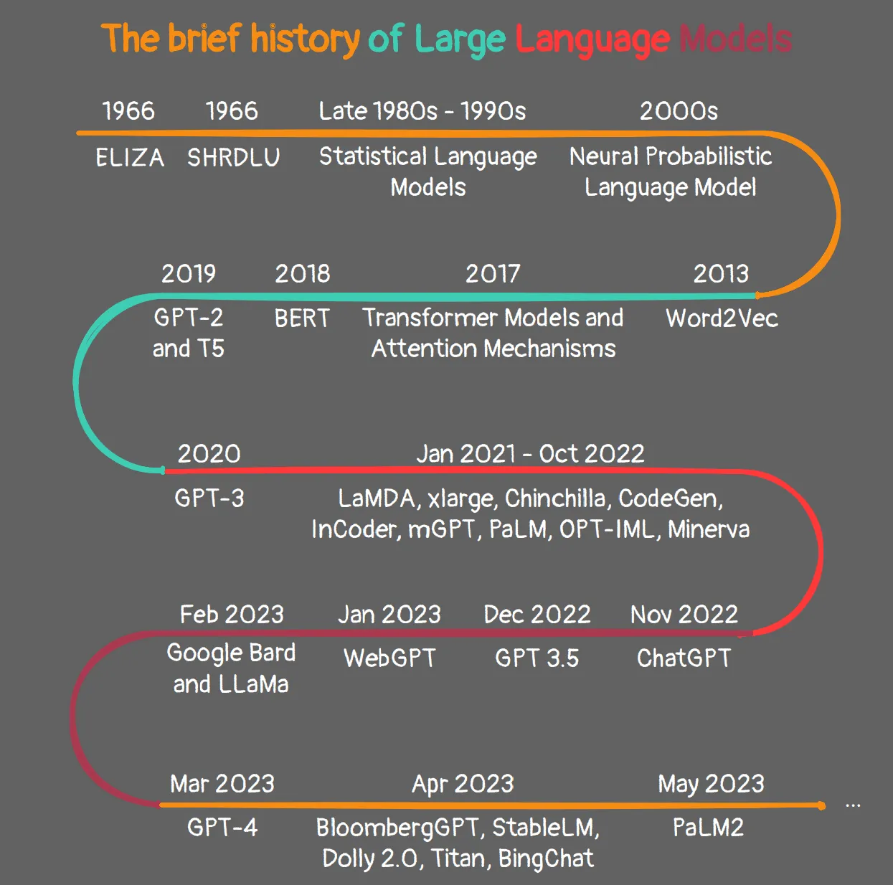
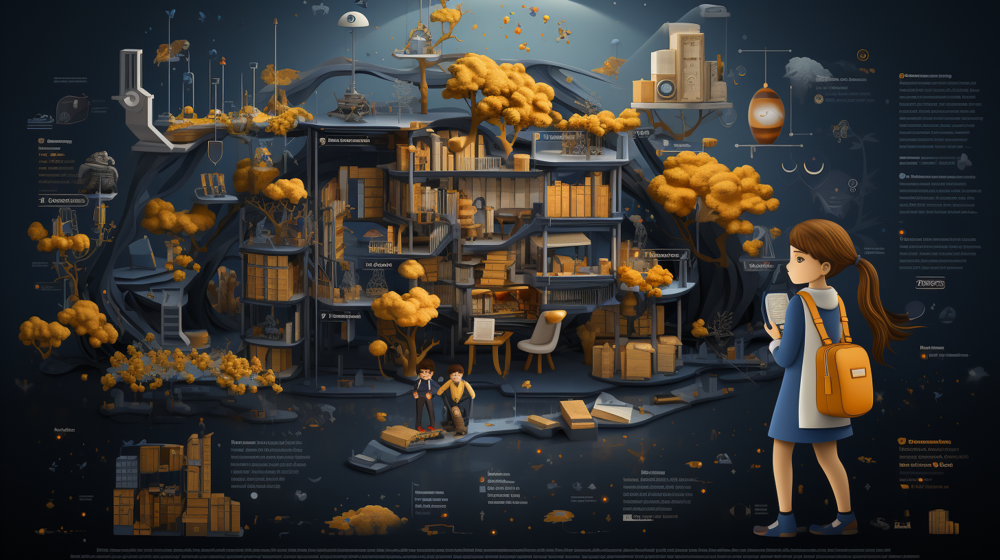

이미지 출처: [The Brief History of Large Language Models](https://levelup.gitconnected.com/the-brief-history-of-large-language-models-a-journey-from-eliza-to-gpt-4-and-google-bard-167c614af5af) by LevelUp on gitconnected

## 서론: 인공지능의 세계로의 초대

안녕하세요, 독자 여러분. 오늘 우리는 인공지능의 세계로 여정을 떠나보려 합니다. 이 여정에서는 자연어 처리와 인간-기계 간 대화의 발전 과정을 자세히 살펴보며, 인공지능이 어떤 방식으로 아이들을 위한 도구로 발전하게 되었는지에 대해 알아보려 합니다.

## ELIZA의 탄생: 인간과 기계의 대화의 시작

먼저, ELIZA에 대해 알아보기로 합시다. ELIZA는 1960년대에 MIT 인공지능 연구소에서 Joseph Weizenbaum에 의해 개발된 초기 자연어 처리 프로그램이며, 인간과 기계의 대화를 가능하게 하는 초기 단계였습니다[^1^].

Weizenbaum의 목표는 단순히 인간과 기계 간의 대화를 가능하게 하는 것이었습니다. 이는 오늘날의 AI 기술 개발 목표와 크게 다르지 않습니다만, 당시에는 이것이 상당한 도전이었습니다.

ELIZA는 심리치료사를 모방하여 대화를 이끌어갔습니다. 그 과정에서 Weizenbaum은 기계가 언어를 이해하고 대화를 이끌어나가는 것처럼 보이게 만들 수 있지만, 실제로 이해하거나 학습하는 능력은 없다는 것을 발견했습니다[^2^]. 더욱 놀라운 것은, 사용자들이 기계에 사람과 같은 지능과 이해를 부여하는 경향이 있음을 발견했다는 것입니다. 이러한 발견은 ELIZA와 같은 초기 인공지능이 인간 형태의 대화를 가능하게 했음을 보여주는 동시에, 그것이 얼마나 어려운 과정인지도 보여줍니다.

## 현대 AI의 발전: ELIZA를 넘어서

ELIZA의 등장은 인간과 기계 간의 대화를 가능하게 하는 초기 단계였습니다. 그러나 ELIZA는 실제로 언어를 이해하거나 학습하지 못했습니다. 그저 사용자의 입력을 특정 패턴과 일치시키고 그에 따라 응답을 생성하는 패턴 매칭 방식을 사용했습니다[^4^]. 이는 실제 문제 해결이나 실제 적용을 위한 깊은 자연어 이해나 학습 능력이 없었음을 의미합니다.

그렇다면, ELIZA가 실제로 언어를 이해하거나 학습하지 못했다면, 우리는 어떻게 현대의 AI 기술이 ELIZA를 뛰어넘게 된 것일까요? 이제 그 비밀을 풀어봅시다.

현대 AI는 기계 학습, 딥 러닝 등의 기술을 포함해 ELIZA보다 더 발전된 기술을 사용하여 더 정교한 대화와 이해를 달성하고 있습니다[^3^]. 이 기술들은 기계가 학습하고, 패턴을 인식하며, 심지어 예측을 할 수 있게 해줍니다.

예를 들어, Google의 대화형 AI인 [Meena](https://ai.googleblog.com/2020/01/towards-conversational-agent-that-can.html)는 27억 개의 매개변수를 가진 Transformer 기반의 모델을 사용하여 사람처럼 대화를 이끌어나갑니다. Meena는 사용자의 입력에 대해 사전에 결정된 방식으로 반응하는 것을 넘어서, 대화의 맥락을 이해하고, 사용자의 의도를 파악하며, 심지어는 미래의 대화를 예측하도록 합니다[^8^].

이러한 발전은 '모방'과 '이해' 사이의 차이를 강조하며, 기계가 실제로 언어를 이해하고 사용하도록 하는 것이 목표입니다. 이는 복잡한 알고리즘과 기계 학습 기법을 사용하여 실현되고 있습니다[^5^].

이런 발전은 단순히 기계가 언어를 이해하고 사용하는 능력을 넘어서, 인공지능이 사람의 감정, 의도, 그리고 문화적 맥락까지 이해하려는 노력의 일환입니다. 이는 인공지능이 사람의 언어를 더욱 인간처럼 이해하고 사용하도록 만드는 데 중요한 발전입니다.

## 아이들을 위한 인공지능: 교육과 심리 지원의 새로운 가능성

현대 AI의 발전은 아이들의 교육과 심리 지원에 엄청난 잠재력을 가지고 있습니다. 인공지능은 다양한 분야에서 아이들에게 도움을 줄 수 있습니다.

교육 분야에서는 AI가 아이들에게 맞춤형 학습 경험을 제공할 수 있습니다. 예를 들어, [Zearn](https://www.zearn.org/)이라는 온라인 학습 플랫폼은 AI를 활용하여 학생들의 학습 패턴과 성장을 추적하고, 이를 바탕으로 개인화된 학습 경로를 제공합니다[^6^]. Zearn은 아이들의 학습 성향과 약점을 파악하여, 그에 맞는 학습 자료와 연습 문제를 제공합니다. 이를 통해 아이들은 자신만의 속도와 방식으로 학습을 진행할 수 있게 되며, 이는 학습의 효과를 극대화하고, 학습에 대한 부담을 줄여줍니다.

심리적 지원 측면에서도 AI는 큰 도움이 될 수 있습니다. [Woebot](https://woebot.io/)과 같은 AI 챗봇은 아이들이 감정을 인식하고 이해하도록 돕고, 그들이 그 감정을 어떻게 표현하고 관리할 수 있는지 가이드해줄 수 있습니다[^7^]. Woebot은 아이들이 스스로의 감정을 인식하고 이해하는 것을 돕는 동시에, 그들이 그 감정을 어떻게 표현하고 관리할 수 있는지에 대한 실질적인 가이드를 제공합니다. 이를 통해 아이들은 감정적 문제를 해결하는 데 능숙해지도록 돕는 데 기여할 수 있습니다.

이러한 AI 도구들의 활용은 아이들의 교육과 심리 지원에 큰 변화를 가져오고 있습니다. 아이들은 자신만의 속도와 방식으로 학습을 진행하며, 감정적 문제를 스스로 해결하는 능력을 키울 수 있게 되었습니다. 이는 아이들이 더 효과적으로 학습하고, 감정적으로 건강하게 성장할 수 있도록 돕는 중요한 발전입니다.

## 결론: 아이들을 위한 인공지능의 미래

아직 우리의 여정은 끝나지 않았습니다. 아이들을 위한 최고의 인공지능을 개발하기 위한 과제들이 여전히 남아 있지만, ELIZA의 탄생부터 현대 AI의 엄청난 발전을 통해 우리는 이 과제를 해결하기 위한 방향성을 잡아나가고 있습니다.

우리는 이미 인공지능을 통해 개인화된 학습 경험을 제공하고, 아이들의 감정을 이해하고 돕는 일련의 도구들을 본격적으로 활용하고 있습니다. 아이들의 성장과 학습에 기여할 수 있는 인공지능의 가능성은 무궁무진하며, 이러한 가능성을 더욱 확장하고 향상시키는 연구와 개발이 계속되고 있습니다.

이 블로그 포스트가 아이들을 위한 인공지능 개발에 대한 당신의 이해를 돕는 데 도움이 되었다면 기쁠 것입니다. 또한, 인공지능이 어떻게 아이들에게 더 나은 미래를 제공하는데 기여할 수 있는지에 대해 더 깊게 알아보려는 분들에게 유익한 자료가 되었을 것입니다.

여러분의 참여와 피드백을 통해 우리의 여정은 더욱 의미있어질 것입니다. 따라서 여러분의 생각이나 질문, 추가적인 아이디어가 있으시다면 아래 댓글 섹션에 자유롭게 남겨주시기 바랍니다. 이를 통해 우리는 서로를 더욱 잘 이해하고, 아이들을 위한 더 나은 인공지능에 대한 깊은 통찰을 얻을 수 있을 것입니다.

가슴이 웅장해지는 여정에 동참해주셔서 감사드립니다! 또한, 이 주제에 대해 더 깊게 탐색하고 싶으신 분들은 [OpenAI](https://openai.com/research/)의 연구를 참고하시기 바랍니다. 이 연구들은 인공지능의 최신 발전을 보여주며, 아이들을 위한 인공지능의 미래에 대한 통찰을 제공합니다.

마지막으로, 이 블로그 포스트가 유익하다고 생각하신다면, 아래의 소셜 미디어 공유 버튼을 통해 친구들과 공유해주시기 바랍니다. 이를 통해 더 많은 사람들이 아이들을 위한 인공지능의 중요성에 대해 알게 되고, 이 주제에 대한 관심을 높일 수 있습니다.

[^1^]: Weizenbaum, J. (1966). ELIZA—a computer program for the study of natural language communication between man and machine. Communications of the ACM, 9(1), 36-45.
[^2^]: Turkle, S. (2005). The second self: Computers and the human spirit. MIT press.
[^3^]: Goodfellow, I., Bengio, Y., & Courville, A. (2016). Deep learning. MIT press.
[^4^]: Russell, S., & Norvig, P. (2016). Artificial intelligence: a modern approach. Malaysia; Pearson Education Limited.
[^5^]: Hinton, G., Deng, L., Yu, D., Dahl, G. E., Mohamed, A. R., Jaitly, N., ... & Kingsbury, B. (2012). Deep neural networks for acoustic modeling in speech recognition: The shared views of four research groups. IEEE Signal processing magazine, 29(6), 82-97.
[^6^]: Luckin, R. (2018). Machine learning and human intelligence: the future of education for the 21st century. UCL Institute of Education Press.
[^7^]: Luxton, D. D. (2016). Artificial intelligence in psychological practice: Current and future applications and implications. Professional Psychology: Research and Practice, 47(5), 332.
[^8^]: Adiwardana, D., Luong, M. T., So, D. R., Hall, J., Fiedel, N., Thoppilan, R., ... & Le, Q. V. (2020). Towards a human-like open-domain chatbot. arXiv preprint arXiv:2001.09977.
