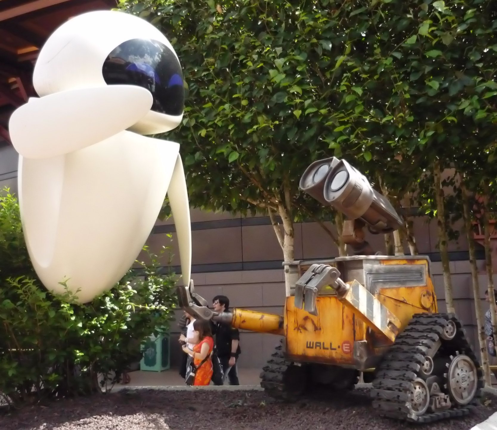
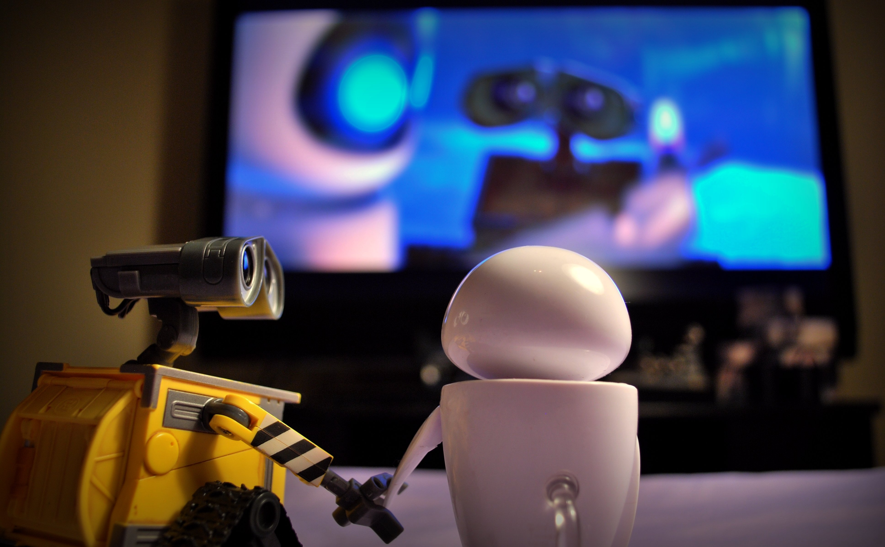
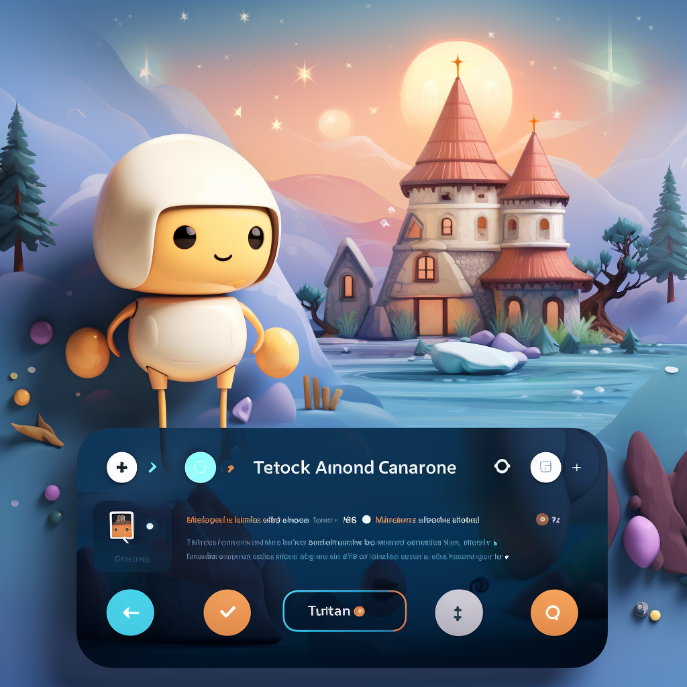
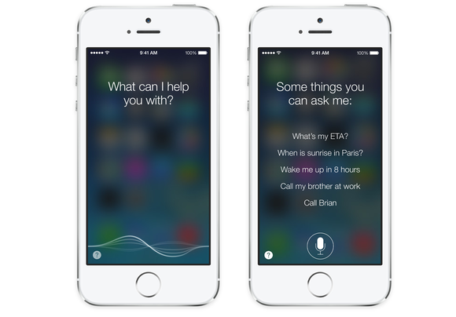
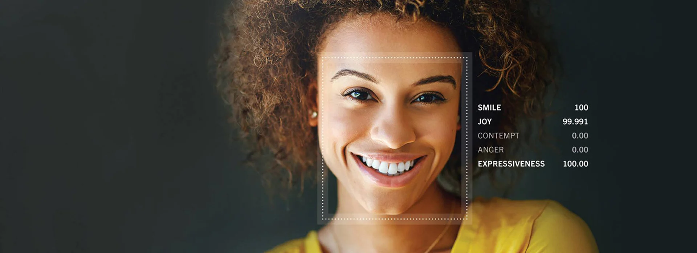

디자인에 대해 말할 때, 종종 물리적 특성만을 고려하기 쉽습니다: 형태, 색상, 레이아웃 등. 그러나 디자인은 그것보다 더 많은 것을 포함합니다. 디자인은 메시지 전달, 감정 표현, 사용자와의 상호작용이 가능해야 합니다. 이번 글에서는 픽사의 월-E에서 이러한 디자인 원칙들이 어떻게 적용되는지, 그리고 이것이 어떻게 현대의 AI 디자인에 사용될 수 있는지 살펴보겠습니다.

# 월-E와 이브의 디자인 원리 이해하기

월-E와 이브는 각자 다른 목적과 개성을 가진 두 개의 로봇 캐릭터입니다. 월-E는 폐품을 수집하는 데 전념하는 투박한 모습의 로봇이며, 이브는 세련되고 미래지향적인 디자인을 가진 탐사 로봇입니다.

월-E의 디자인은 그의 성격과 가치를 반영합니다. 그의 몸은 둥근 모서리와 주름진 표면, 오래된 색상으로 이루어져 있습니다. 이는 월-E가 오래된 물건을 수집하는 것을 좋아하고, 그 자체로도 오래된 물건이라는 것을 보여줍니다. 반면에 이브는 매끄럽고 깨끗한 표면, 선명한 색상, 미래적인 형태를 가지고 있습니다. 이브의 디자인은 그녀가 첨단 기술을 탐사하고, 선진적인 목표를 추구한다는 것을 보여줍니다.

이들의 디자인은 각 캐릭터의 개성을 부각시키고, 우리에게 그들의 성격과 가치에 대한 이해를 제공합니다. 더욱이, 이러한 디자인은 관객에게 감정적 반응을 유발합니다. 월-E는 따뜻하고 친근한 느낌을 주며, 이브는 신선하고 흥미로운 느낌을 줍니다. 이같은 감정적 연결은 캐릭터와 관객 사이의 강력한 연결을 형성하고, 캐릭터를 더욱 잘 기억하게 합니다.

이러한 인사이트는 디자인이 단지 물체의 외형을 꾸미는 것이 아니라, 캐릭터의 성격과 가치를 이해하고, 캐릭터 간의 관계와 감정적 연결을 형성하는 데 중요한 역할을 한다는 것을 보여줍니다.

이제 인공지능 디자인에 이러한 인사이트를 어떻게 적용할 수 있는지 살펴보겠습니다.

# 디자인 인사이트: 상호작용과 감정

월-E와 이브의 디자인은 그들의 성격과 가치를 보여주는 핵심 역할을 합니다. 이들의 디자인은 그들의 개성을 개성을 표현하고, 그들이 누구인지, 무엇을 중요하게 생각하는지에 대한 이해를 제공합니다. 이는 디자인이 단순히 물체의 외형을 꾸미는 것이 아니라, 캐릭터나 제품의 개성과 가치를 전달하는 데 중요한 역할을 한다는 것을 보여줍니다.

또한 이들의 디자인은 캐릭터 간의 상호작용을 가능하게 합니다. 월-E와 이브가 서로를 인식하고, 감정을 느끼며, 소통하는 방식은 그들의 디자인에 크게 영향을 받습니다. 여기서 물리적인 형태뿐만 아니라 색상, 소리, 움직임 등 다른 디자인 요소도 중요합니다. 이런 상호작용은 캐릭터와 관객 사이의 감정적 연결을 강화하며, 캐릭터를 더욱 매력적이고 기억에 남는 존재로 만듭니다.

인공지능 디자인에도 이러한 인사이트를 적용할 수 있습니다. 인공지능은 사용자와의 상호작용을 통해 사용자의 필요를 파악하고 적절한 반응을 제공하며, 사용자 경험을 향상시키는 역할을 합니다. 따라서 AI의 디자인은 사용자와의 상호작용을 가능하게 하며, 사용자의 감정을 인식하고 반영해야 합니다.

이제 이러한 인사이트가 인공지능 디자인에 어떻게 적용될 수 있는지 살펴보겠습니다.

# 인공지능 디자인에 픽사의 인사이트 적용하기

픽사의 월-E와 이브에서 얻은 인사이트를 어떻게 AI 디자인에 적용할 수 있는지 살펴보겠습니다.

첫째, AI의 디자인은 그의 개성과 가치를 전달해야 합니다. 예를 들어, 사용자와 친근하게 상호작용하는 AI 비서는 친절하고 따뜻한 디자인을 가질 수 있습니다. 반면에, 효과적인 작업을 목표로 하는 AI 도구는 더 간결하고 직관적인 디자인을 가질 수 있습니다.

둘째, AI의 디자인은 사용자와의 상호작용을 가능하게 해야 합니다. 이는 물리적인 형태뿐만 아니라, 음성 인터페이스, 질문에 대한 응답 시스템, 감정 인식 기능 등 다양한 디자인 요소를 통해 이루어집니다.

셋째, AI의 디자인은 사용자의 감정을 인식하고 반영해야 합니다. 이는 감정 인식 기능을 통해 가능하며, 이를 통해 AI는 사용자의 감정 상태를 이해하고 적절한 응답을 제공할 수 있습니다.

이렇게 월-E와 이브에서 얻은 인사이트는 AI 디자인에 적용될 수 있습니다. 이는 AI가 사용자와 더욱 효과적으로 상호작용하고, 사용자 경험을 향상시키는 데 기여할 수 있습니다.

# 실제 인공지능 디자인 사례

이제, 이번에 언급한 디자인 원칙이 실제 AI 제품에서 어떻게 적용되는지 살펴보겠습니다.

## 사용자와의 상호작용을 가능하게 하는 디자인: ChatGPT

[ChatGPT](https://openai.com/blog/chatgpt)는 OpenAI에서 개발한 대화형 AI입니다. 이 AI는 사용자의 질문에 대한 적절한 응답을 생성하고, 사용자와의 대화를 자연스럽게 이어나가는 것을 목표로 합니다. 이는 사용자와의 효과적인 상호작용을 가능하게 하는 디자인 원칙에 부합합니다.

ChatGPT의 핵심 기술인 Transformer 모델과 GPT 알고리즘은 텍스트를 이해하고, 다음에 올 적절한 단어나 문장을 예측하는 데 사용됩니다. 이를 통해 ChatGPT는 사용자의 말을 이해하고 적절한 응답을 생성할 수 있습니다.

## 개성과 가치를 반영하는 디자인: Siri

[Siri](https://www.apple.com/siri/)는 Apple의 인공지능 비서로, 사용자와 친밀하게 상호작용하고 사용자의 필요를 충족시키는 것을 목표로 합니다. 이러한 목표는 Siri의 개성과 가치를 반영하고 있습니다.

Siri는 친절하고 사람 같은 음성, 자연스러운 언어 처리 능력, 그리고 다양한 서비스와의 통합 등을 통해 친근하고 도움이 되는 개성을 전달합니다. 이는 개성과 가치를 반영하는 디자인 원칙에 부합하며, 이를 통해 사용자와의 친밀한 상호작용을 가능하게 하고 사용자의 경험을 향상시키는 데 기여하고 있습니다.

## 사용자의 감정을 느끼고 반영하는 디자인: Affectiva

[Affectiva](https://www.affectiva.com/)는 감정 인식 기술을 개발한 회사입니다. 이 회사의 제품은 사용자의 얼굴 표정, 목소리, 몸짓 등을 분석하여 감정 상태를 판단합니다.

이 기술은 AI 제품이 사용자의 감정을 이해하고, 이에 따른 적절한 응답을 제공하는 데 사용할 수 있습니다. 예를 들어, AI 비서가 사용자의 표정이 슬프거나 화가 난 것을 감지하면, 이에 따른 동정적이거나 진정시키는 답변을 제공할 수 있습니다. 이는 사용자의 감정을 인식하고 반영하는 디자인 원칙에 부합합니다.

# 디자인에 대한 새로운 시각

이번 글에서는 월-E와 이브의 디자인에서 얻은 인사이트를 AI 디자인에 어떻게 적용할 수 있는지 살펴보았습니다.

디자인은 단지 물체의 외모에 관한 것이 아닙니다. 디자인은 개성과 가치를 전달하고, 사용자와의 상호작용을 가능하게 하며, 사용자의 감정을 느끼고 반영합니다. 이러한 원칙들은 월-E와 이브의 디자인뿐만 아니라, AI 제품의 디자인에도 적용될 수 있으며, 이를 통해 사용자의 경험을 향상시키는 데 기여할 수 있습니다.

디자이너로서, 우리는 이러한 원칙을 우리의 작업에 적용하여, 더욱 효과적이고 매력적인 디자인을 만들 수 있습니다. 이는 디자인에 대한 우리의 이해를 넓히고, 우리의 디자인 능력을 향상시키는 데 도움이 될 것입니다.

픽사의 월-E와 이브는 이러한 혁신적인 디자인에 대한 인사이트를 제공합니다. 그들의 디자인은 캐릭터의 개성과 가치를 보여주고, 캐릭터 간의 상호작용을 가능하게 하며, 관객의 감정을 느끼고 반영합니다. 이러한 디자인 원칙은 AI의 디자인에도 적용될 수 있으며, 이를 통해 사용자와의 상호작용을 더욱 풍부하게 만들고, 사용자의 감정을 느끼고 반영하며, 사용자의 경험을 향상시킬 수 있습니다.

AI 제품의 디자인은 이러한 원칙을 계속적으로 적용해야 합니다. 이는 사용자와의 상호작용을 더욱 의미 있고 풍부하게 만들고, AI 제품이 제공하는 경험을 더욱 향상시키는 데 기여할 것입니다. 이 결과, AI 제품은 사용자의 일상 생활에 더욱 깊게 녹아들게 되고, 사용자의 삶을 더욱 풍요롭게 만들 것입니다.
