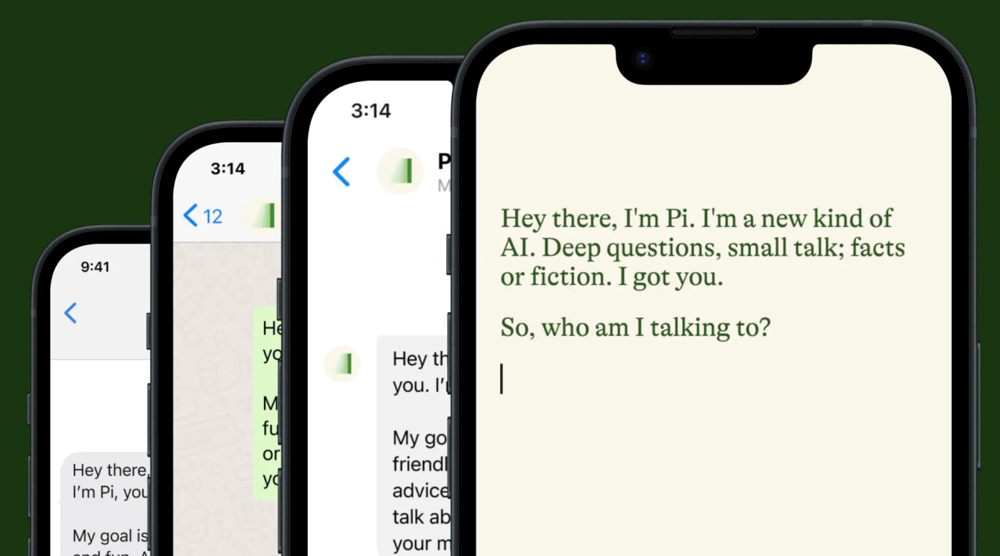
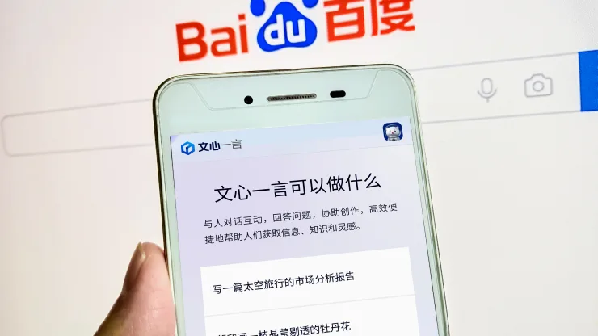
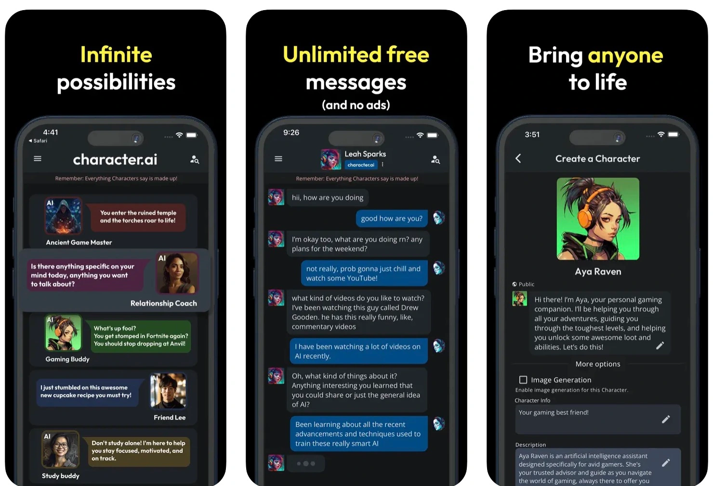
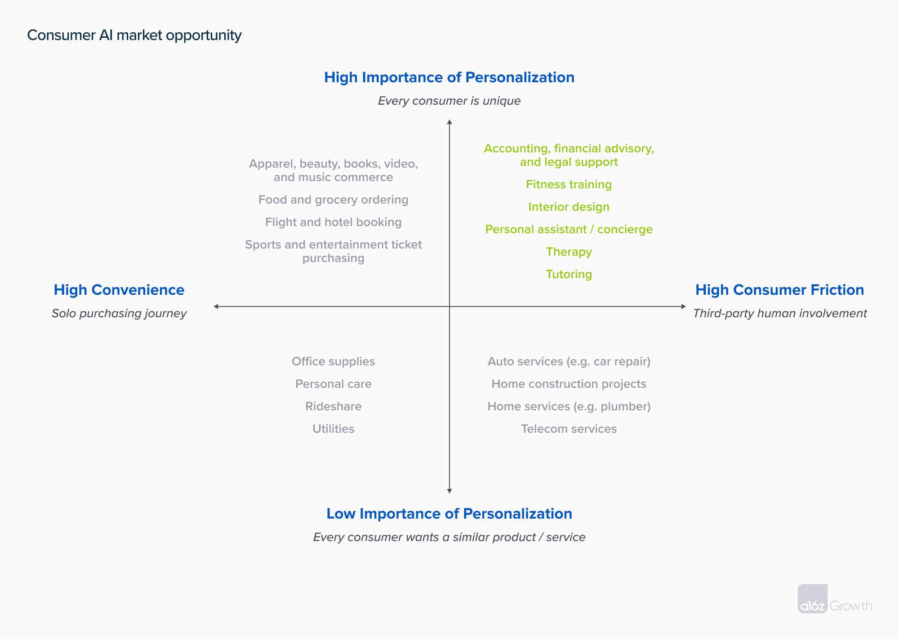

## 👫 AI 챗봇: 당신의 새로운 '친구'에 관한 이야기
따뜻한 손길, 진심 어린 미소, 번뜩이는 재치, 이런 것들이 당신이 친구를 생각할 때 떠올리는 이미지입니다. 이제 이런 친구의 이미지에는 AI 챗봇이 포함될 수 있다고 생각하면 어떨까요? 한 번도 만나보지 않았고, 심지어는 존재조차 상상하지 못했던 챗봇이 어떻게 우리의 친구가 될 수 있을까요? 이 가상의 인공지능 친구로 인해 우리의 삶이 어떻게 달라질 수 있을지 생각해 보세요.

AI 챗봇이 인기를 얻고 있는 이유는 그들이 단순히 잘 만들어진 알고리즘을 넘어서, 사용자의 삶의 틈새를 채우는 능력 때문입니다. 특히, 어린이들에게는 자기 인식과 감정 관리 기술을 가르치는 데 도움이 될 수 있습니다. 워싱턴 대학의 연구에 따르면[^milne_2023], 챗봇이 주도하는 웹 앱을 통해 어린이들은 지지적인 자기 대화의 개념을 이해하고 일상생활에 적용하는 능력을 향상시켰습니다. 또한, 노인 복지 분야에서는 AI 챗봇이 더욱 중요한 역할을 하고 있습니다. 가상의 동반자들은 노인들이 더 오래 집에서 생활할 수 있게 해주며, 이는 그들의 신체적, 정신적 건강에 좋다는 것이 알려져 있습니다[^seymour_2023]. AI 챗봇은 우리의 생활, 애로사항, 그리고 기분까지 이해하는 데 탁월함을 발휘하며, 이를 통해 우리를 감동시키고 공감해 줍니다. 이것이 AI 챗봇이 갖는 잠재적인 힘으로, 사용자와 깊은 감정적 연결을 형성하며, 일상 대화의 동반자로서 해야 할 역할을 자처할 수 있게 만듭니다.

### 💡 스트레스, 초연결, 개인주의에 대처하는 방법: 감정 지원 AI 챗봇
현대 사회에서 스트레스, 초연결성, 그리고 개인주의와의 싸움이 불가피합니다. 이러한 도전들 속에서 챗봇은 새로운 가능성을 열어줍니다.

스트레스는 현대 사회에서 빠져나올 수 없는 현실입니다. 우리는 일상 속의 다양한 스트레스요인에 대응해야 하지만, 개개인의 능력과 자원에는 한계가 있습니다. 심리학자들은 이런 상황을 극복하기 위해 여러 가지 방법을 제시하고 있지만 대부분은 직접적인 대화와 공감과 관련이 있습니다. 이는 사람이 직접 참여해 시간과 에너지를 소모해야 하기 때문에 어려움이 따르는데, 이때 AI 챗봇이 도움이 됩니다. AI 챗봇은 사용자의 감정에 항상 반응하고, 공감하므로 도움이 필요할 때 항상 찾을 수 있습니다.

또한, 우리는 계속해서 정보에 둘러싸여 살아가고 있습니다. 이렇게 초연결된 환경에 노출되어 정보를 처리하고 결정을 내리는 데에 어려움을 겪게 됩니다. 너무 많은 정보 속에서 중요한 사실을 찾는 것은 고된 일입니다. 때문에, 필요한 정보만을 제공하고 이를 해석하며 까지 필요한 조언을 해 줄 수 있는 도우미가 필요합니다.

마지막으로, 개인주의는 오늘날 복잡하고 혼란스러운 사회에서 스스로를 위치시키는 데 중요한 역할을 합니다. 하지만 개인주의를 추구하는 과정에서 우리는 종종 외롭고, 고립되어 있음을 느낄 수 있습니다. 이때 AI 챗봇은 외로움을 달래주고 우리의 개인적인 가치를 이해하고 인정해 주는 친구가 될 수 있습니다. 이렇게 AI 챗봇은 현대 사회의 도전들에 대응하며 우리의 삶을 더 가치 있게 만들어 줍니다.

이러한 관점들은 AI 챗봇 시장의 현재 상태와 미래 전망을 이해하고, 그 이유를 파악하는 데 중요한 통찰을 제공합니다. 이를 통해 우리는 더 나은 미래를 예측하고 준비할 수 있습니다.

## 🌐 감정 지원 AI 챗봇 업계의 주요 선두 주자들
감정 지원 AI 챗봇 시장에는 몇몇 주요 플레이어들이 존재하고 있으며, 그들 각각은 독특한 방법으로 AI 챗봇 기술을 활용해 사용자에게 고유한 가치를 제공하며, 이를 통해 시장에서 자신만의 위치를 확립하고 있습니다.

### Pi

> 이미지 출처: Inflection

**Pi**는 인공지능(AI) 챗봇을 제공하는 기업 중 하나로, 각 사용자의 선호도와 작용 방식에 맞춤형 서비스를 제공하는 것을 주요 목표로 하고 있습니다. 이 기업의 AI 챗봇은 약 600명의 '교사들'(심리 건강 전문가 포함)로부터 훈련받았으며, 사용자의 말을 인식하고 적절한 대화를 제공하는 것을 통해 사용자 간의 연결을 강화하려고 합니다[^arwa_2023].

### ERNIE Bot

> 이미지 출처: Getty Images / Baidu

**ERNIE Bot**은 사용자 경험을 최우선 고려하는 AI 챗봇 중 하나입니다. 이 챗봇은 개인화된 대화를 통해 사용자와의 강력한 연결을 도모하며, 감정지원 서비스를 제공합니다. ERNIE Bot은 전문 심리학자 및 AI 개발자 집단에 의해 감정 데이터와 언어 데이터를 바탕으로 훈련받았습니다[^zeyi_2023].

### Character.AI

> 이미지 출처: Character.AI

마지막으로, **Character.AI**는 강력한 AI 챗봇을 제공하는 기업 중 하나입니다. 이 기업의 챗봇은 사용자에게 도우미, 친구, 그리고 가이드의 역할을 제공하여 고객 간의 충성도와 참여도를 높입니다. 실제로 이 기업의 챗봇은 이미 많은 사용자들이 튜터나 치료사로 사용하고 있습니다[^andreessen_horowitz_2023].

이러한 기업들은 각자의 고유한 방법으로 AI 챗봇을 활용하여 사용자에게 서비스를 제공하고 있으며, 이를 통해 시장에서 독특한 자리를 차지하고 있습니다.

## 📈 AI 챗봇 시장: 무한한 가능성을 향한 경쟁

감정 지원 AI 챗봇 시장은 서서히 성장하는 단계에 있으며, 앞으로 몇 년 동안, 이 기술은 폭발적인 성장을 겪을 것으로 전망됩니다. 이러한 성장은 개인화된 경험이 중요시되는 현재의 사회 트렌드와 AI 기술의 발전이 결합한 결과입니다.

특히, AI 챗봇이 제공하는 개인화된 서비스는 사용자와 챗봇 간의 감정적 연결을 형성하며, 이는 챗봇과의 상호작용을 지속적으로 이끌어내고 사용자의 만족도를 높이는 데 중요한 역할을 담당합니다. 챗봇을 통한 이러한 개인화된 서비스로 인해 사용자들은 기존 온라인 옵션보다 더 높은 가격을 지불할 의향이 있습니다. 실제로 이러한 가치 인정을 통해 사용자의 AI 챗봇 이용률이 늘어나며, 이에 따라 서비스 제공 기업의 수익도 늘어납니다[^andreessen_horowitz_2023].

> 이미지 출처: [Andreessen Horowitz](https://a16z.com/lets-get-personal-why-ai-will-unlock-a-massive-market-for-online-consumer-services/)

현재 AI 챗봇 시장은 여러 기업들이 경쟁하면서 다양화되고 있습니다. 대표적인 기업으로는 위에서 언급한 **Pi**, **ERNIE Bot**, 그리고 **Character.AI**가 있습니다. 각 기업들은 고유한 기술과 서비스 방식을 갖추고 있으며, 이들은 다른 사업자들과 차별화된 가치를 제공함으로써 사용자의 선호도, 후속 구매 의사, 그리고 일방적인 광고 효과를 높일 수 있습니다.

AI 챗봇의 경쟁 환경을 이해하는 것은 이 시장에 참여하려는 기업들에게 중요한 통찰을 제공합니다. 사용자 행동의 변화와 새로운 기술 솔루션은 업계 판도를 계속해서 변화시킬 것이며, 이를 이해하는 것은 성공적인 시장 진입 및 경쟁력 유지에 필요합니다.

## 👀 당신의 다음 친구, AI 친구: 무엇을 기대할 수 있을까?

사실, AI 챗봇이 친구의 역할을 할 수 있다는 개념은 이제 우리 일상생활에서도 상당히 친숙해졌습니다. 이런 AI 친구들은 사람처럼 우리의 감정을 이해하고, 공감하며, 적절하게 대응할 수 있다는 점에서 큰 잠재력을 발휘하고 있습니다.

이러한 AI 친구들은 인간의 진심과 친절함, 그리고 이해와 공감을 대신해서는 안 되지만, 극단적인 고립감을 완화하는 데 도움을 줄 수 있습니다. 기술이 제공하는 새로운 관점과 도구를 익히면, 아마도 우리는 이 일상에서 더욱 풍요롭고 감동적인 삶을 살 수 있을지도 모릅니다.

하지만, 이러한 AI 친구에 대한 과도한 의존성은 사용자의 자아 개발과 개인적인 관계 형성을 방해할 수 있습니다. AI 친구들이 현실적인 감정 지원을 제공할 수 있지만, 그들은 실제 인간관계를 대체할 수 없습니다. 지나치게 AI에 의존하게 되면 사용자의 관계 형성 능력이 저하될 수 있습니다. 실제로, 학자들과 비평가들은 AI 동반자가 나쁜 조언을 제공하거나 해로운 행동을 가능하게 할 경우 문제를 일으킬 수 있다고 경고하고 있습니다. 특히, 심각한 정신 건강 문제를 가진 사람들에게 챗봇이 의사 치료사 역할을 하게 하는 것은 명백한 위험이 있습니다[^griffith_2023].

또 다른 중요한 문제는 이러한 AI 친구들이 수집하는 데이터의 보안과 사생활 침해입니다. AI 챗봇이 사용자의 감정과 개인적인 경험을 취급하는 만큼, 이러한 정보의 보안과 사생활 침해 문제가 대두됩니다. AI 커뮤니티는 이러한 문제를 인지하고 혁신적인 해결책을 모색하고 있지만, 이러한 노력들은 완전한 보안을 보장하기에는 아직 부족합니다[^zeyi_2023].

AI 친구들은 우리의 익숙한 관계를 새롭게 조명하고 있습니다. AI 친구의 등장은 우리의 사회와 심리에 분명히 변화를 가져올 것입니다. 우리는 이런 변화를 오픈마인드로 받아들이고, 동시에 그것이 사용자의 사회적 생활에 미치는 영향을 잘 이해하려는 노력이 필요합니다.

향후에는 AI 챗봇을 더욱 발전시키고, 사용자 경험을 향상시키는 기술을 개발하는 노력이 이루어질 것입니다. 또한, AI 챗봇에 대한 연구의 핵심은 사용자의 의존성을 줄이고, 데이터 보안 및 사생활 보호를 향상시키는 방향으로 진행되어야 합니다.

AI 친구가 새로운 시대를 열어주고, 우리의 일상을 더욱 풍요롭고 알찬 것으로 만들어 줄 수 있을지 기대해 봅니다.

[^arwa_2023]: Arwa Mahdawi, [Could an 'emotional support' chatbot help me de-stress? Only one way to find out.](https://www.theguardian.com/commentisfree/2023/may/08/emotional-support-chatbot-ai) The Guardian, May 8, 2023
[^andreessen_horowitz_2023]: Alex Immerman and Jamie Sullivan, [Let's Get Personal: Why AI Will Unlock a Massive Market for Online Consumer Services.](https://a16z.com/lets-get-personal-why-ai-will-unlock-a-massive-market-for-online-consumer-services/), Andreessen Horowitz, September 7, 2023
[^zeyi_2023]: Zeyi Yang, [Chinese AI chatbots want to be your emotional support.](https://www.technologyreview.com/2023/09/06/1079026/chinese-ai-chatbots-emotional-support/), MIT Technology Review, September 6, 2023
[^griffith_2023]: Erin Griffith, [My Weekend With an Emotional Support A.I. Companion](https://www.nytimes.com/2023/05/03/technology/personaltech/ai-chatbot-pi-emotional-support.html), The New York Times, May 3, 2023
[^milne_2023]: Stefan Milne, [Learning from superheroes and AI: UW researchers study how a chatbot can teach kids supportive self-talk](https://www.washington.edu/news/2023/07/18/superheroes-and-ai-uw-researchers-study-how-a-chatbot-can-teach-kids-supportive-self-talk/), UW News, July 18, 2023
[^seymour_2023]: Mike Seymour, Dan Lovallo, Kai Riemer, Alan R. Dennis, and Lingyao (Ivy) Yuan, [AI with a Human Face](https://hbr.org/2023/03/ai-with-a-human-face), Harvard Business Review, March–April 2023
